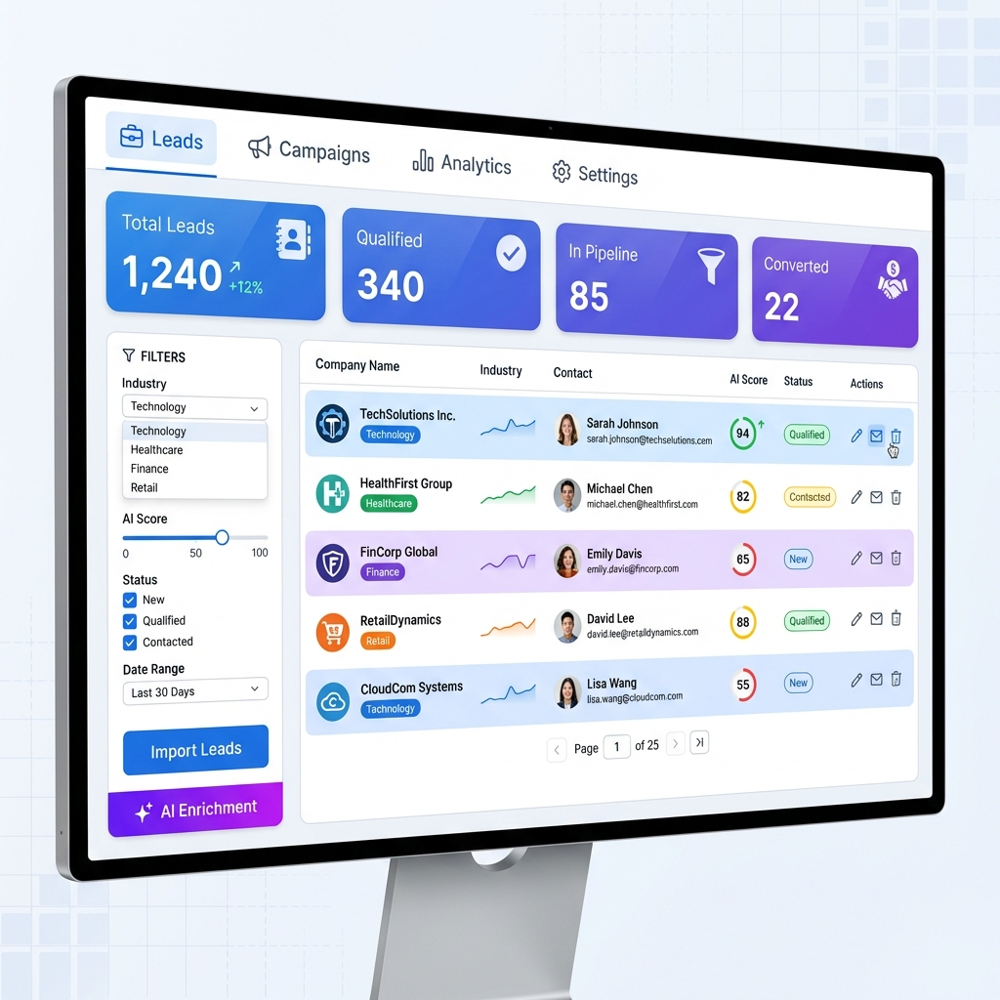
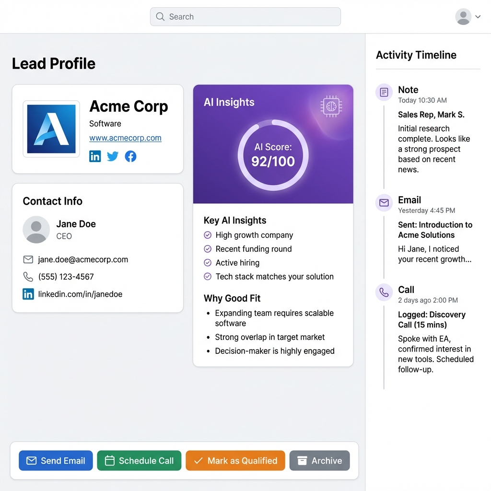
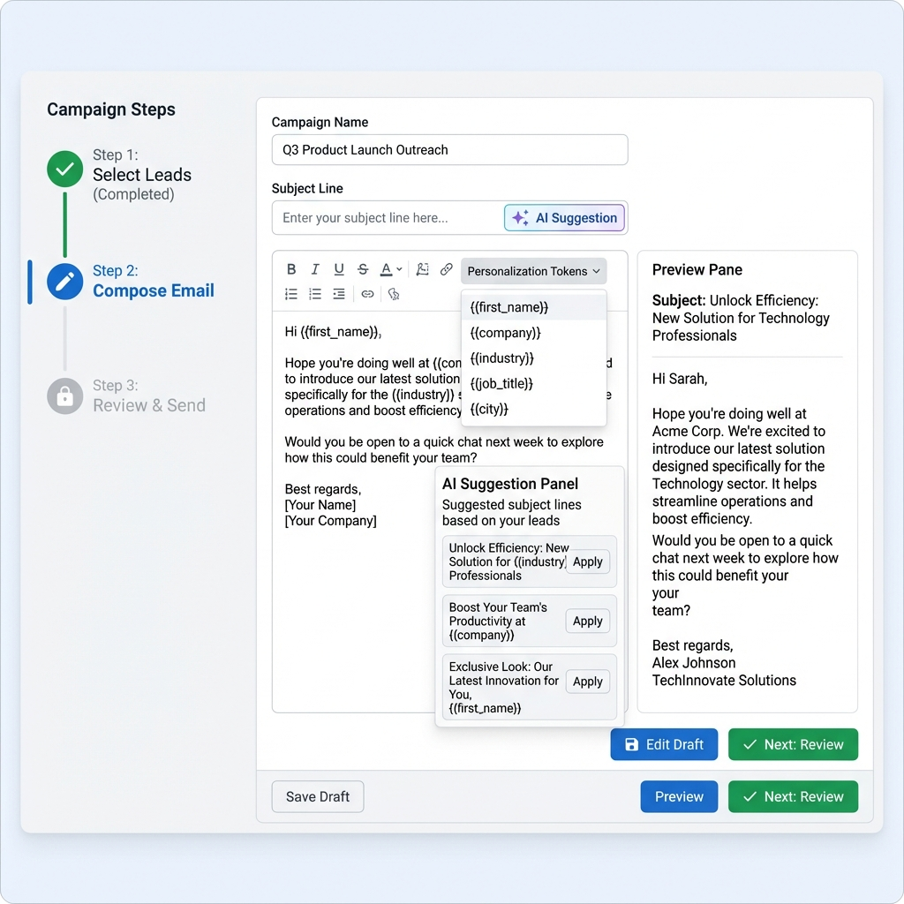
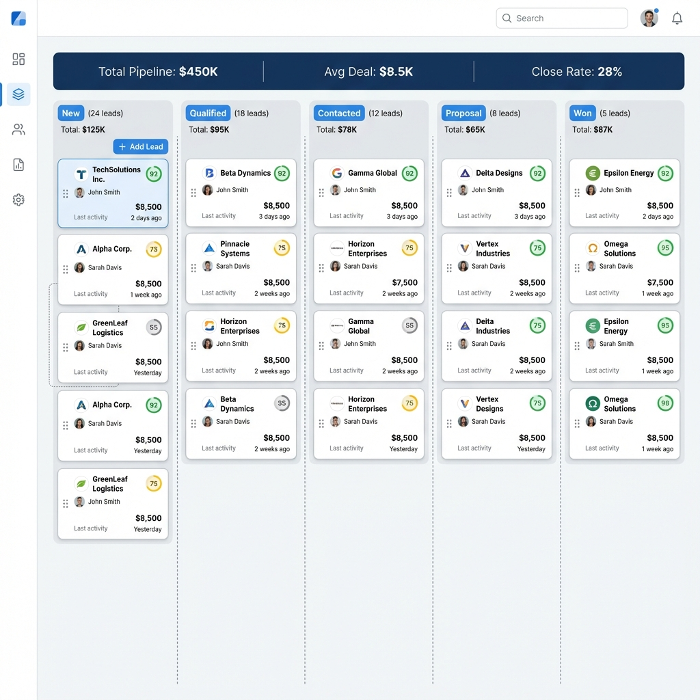

# Wireframes - MVP #6: AI Lead Finder + CRM

## 1. Leads Dashboard

- Stats cards: Total, Qualified, In Pipeline, Converted
- Lead table with AI score badges (color-coded)
- Filters: Industry, AI Score slider, Status
- "Import Leads" and "AI Enrichment" buttons

## 2. Lead Detail

- Company card with contact info
- AI Insights panel (score + reasons)
- Activity timeline
- Actions: Send Email, Schedule Call, Mark Qualified

## 3. Email Campaign Builder

- 3-step wizard
- AI suggestion for subject lines
- Rich text editor with personalization tokens
- Preview pane

## 4. Pipeline Kanban

**Components**:

- Drag-and-drop lead cards
- Card shows: company, AI score, $ value
- Column headers: count + total value

**Last Updated**: 2026-01-14  
**Images**: 4/4 ✅
